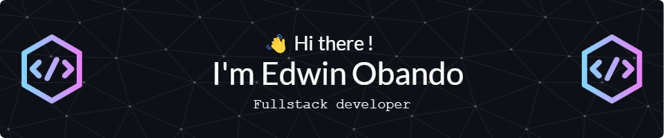
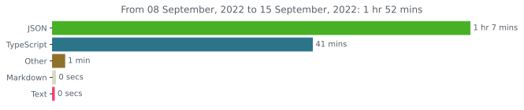

<h1 align="center">👨‍💻 Whoami</h1>
 

    

    

 

    
    
    

    <samp>
    A highly resourceful computer programmer and well-rounded IT professional with over five years of computing experience, possessing expert knowledge of the software development lifecycle and a solid understanding of technologies required for the development and deployment of highly available and scalable applications, including their networks and infrastructure.
    </samp>    
     

 
 

<h1 align="center">📊 Stats</h1>

    
    

 
 

<h1 align="center">🏆 GitHub Trophies</h1>

    

<!--
**Mecrano/Mecrano** is a ✨ _special_ ✨ repository because its `README.md` (this file) appears on your GitHub profile.

Here are some ideas to get you started:

- 🌱 I’m currently learning ...
- 👯 I’m looking to collaborate on ...
- 🤔 I’m looking for help with ...
- 💬 Ask me about ...
- 📫 How to reach me: ...
- 😄 Pronouns: ...
- ⚡ Fun fact: ...
-->

<!--## 🔭 I’m currently working on

-->
